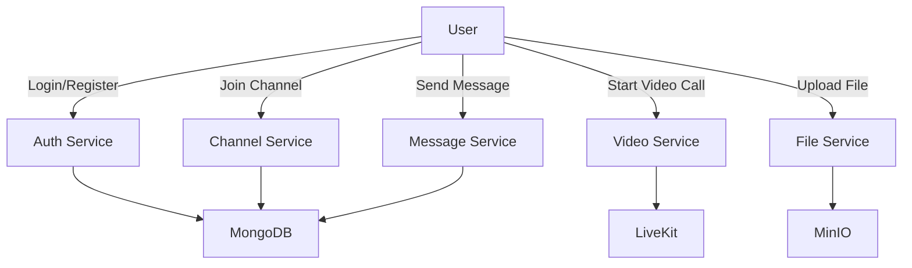
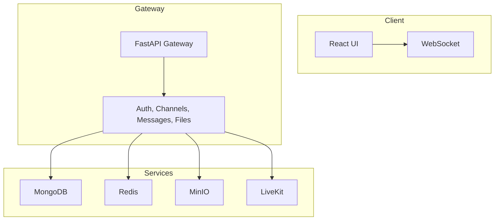
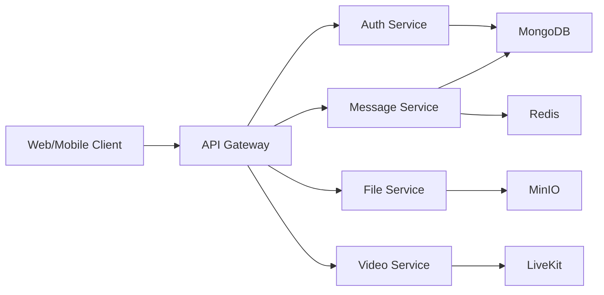
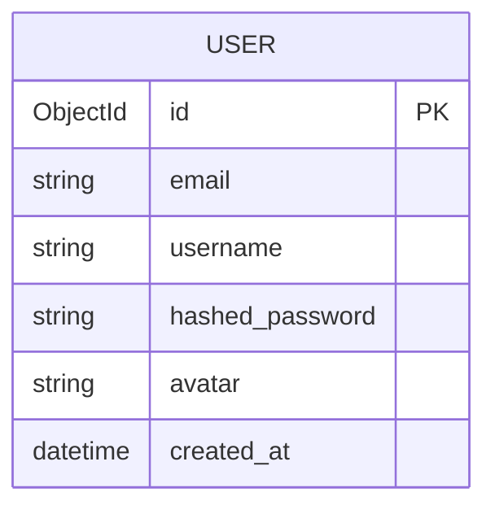
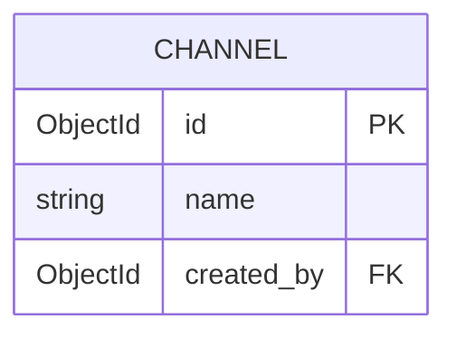
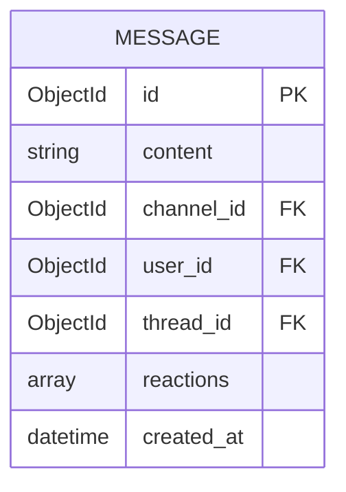

# 🚀 Slack Collaboration Tool Clone

A modern, full-stack Slack-like collaboration platform built with cutting-edge technologies, featuring real-time messaging, video calls, file sharing, and more.

[](https://opensource.org/licenses/MIT)
[](https://www.python.org/)
[](https://reactjs.org/)
[](https://www.typescriptlang.org/)
[](https://fastapi.tiangolo.com/)
[](https://www.mongodb.com/)
[](https://redis.io/)
[](https://min.io/)
[](https://livekit.io/)

[](https://www.docker.com/)


---

## 📋 Table of Contents

* [✨ Features](#-features)
* [🗼 App Preview](#-app-preview)
* [🛠️ Tech Stack](#-tech-stack)
* [🏗️ Architecture](#-architecture)
* [💄 Database Schema](#-database-schema)
* [📚 Documentation](#-documentation)
* [🔌 API Reference](#-api-reference)
* [🚀 Quick Start](#-quick-start)
* [🐳 Docker Installation](#-docker-installation)
* [🔧 Development Setup](#-development-setup)
* [🧪 Testing](#-testing)
* [📦 Deployment](#-deployment)
* [🤝 Contributing](#-contributing)
* [📄 License](#-license)
* [❤️ Acknowledgements](#-acknowledgements)


---


## ✨ Features

> 🧩 Built to emulate the core experiences of modern collaboration tools like Slack, Zoom, and Notion — all in one workspace.

### ⚙️ Core Functionality Overview

| 🔧 Feature                 | 📝 Description                                                             |
| -------------------------- | -------------------------------------------------------------------------- |
| 💬 **Live Chat**           | Real-time messaging using WebSockets with channel-based threads.           |
| 📞 **Video Calls**         | Seamless group video and audio calling using **LiveKit** integration.      |
| 📂 **File Sharing**        | Upload and share files securely via **MinIO**, with drag-and-drop support. |
| 🧵 **Message Threads**     | Keep discussions focused using threaded replies and reactions.             |
| 😊 **Emoji Reactions**     | React with emojis to lighten up conversations.                             |
| 🔔 **Notifications**       | Real-time desktop and in-app notifications for mentions, messages, etc.    |
| 🛡️ **JWT Authentication** | Secure login/signup flows using access tokens and refresh tokens.          |
| 🔐 **Permissions**         | Fine-grained role-based access and private/public channel toggles.         |

---

### 🧠 Visual Feature Map



---

## 🗼️ App Preview

### Login 


### Registration


### Dashboard Overview


### Messaging & Threading


### Call Preview


### Video Call


---

## 🛠️ Tech Stack

### 🧹 Frontend

* React 18, TypeScript, Vite
* Tailwind CSS
* Zustand, React Query
* React Router DOM, Lucide Icons
* Socket.IO client, React Dropzone
* Markdown, Emoji Picker

### 🚀 Backend

* FastAPI, Uvicorn, Pydantic
* Motor (MongoDB), Redis
* WebSockets, JWT (Python-Jose)
* MinIO SDK, Passlib

### 🧱 Infrastructure

* Docker & Docker Compose
* Helm Charts for Kubernetes
* GitHub Actions CI/CD
* LiveKit Server for video
* PNPM + TurboRepo

---

## 🏗️ Architecture

### System Architecture



### Microservices View



---

## 💄️ Database Schema

### User



### Channel



### Message



---

## 📚 Documentation

### Project Structure

```
slack-clone/
├── apps/
│   ├── api/         # FastAPI backend
│   └── web/         # React frontend
├── docker-compose.yml
├── helm/            # Helm charts
└── livekit.yaml     # LiveKit config
```

### Concepts

* JWT-based Auth flow
* Live WebSocket chat engine
* Secure file uploads to MinIO
* Real-time user presence
* Threaded messages with Markdown

---

## 🔌 API Reference

### 🔐 Auth

* `POST /auth/register`
* `POST /auth/login`

### 📨 Channels

* `GET /channels`
* `POST /channels`

### 📩 Messages

* `GET /messages/:channel_id`
* `POST /messages`

### 📁 Files

* `POST /files/upload`

### 📹 Video

* `POST /video/token`

---

## 🚀 Quick Start

### Prerequisites

* Docker & Docker Compose
* Node 18+
* Python 3.8+
* PNPM

### Clone and Start

```bash
git clone https://github.com/yourusername/slack-clone.git
cd slack-clone
docker-compose up -d
```

### Seed Database

```bash
docker-compose exec api python scripts/seed.py
```

---

## 🐳 Docker Installation

```bash
# Build & run
docker-compose up -d

# Stop all
docker-compose down
```

---

## 🔧 Development Setup

### Backend

```bash
cd apps/api
python -m venv venv
source venv/bin/activate
pip install -r requirements.txt
uvicorn main:app --reload
```

### Frontend

```bash
cd apps/web
pnpm install
pnpm dev
```

---

## 🧪 Testing

### Backend

```bash
cd apps/api
pytest
pytest --cov=app --cov-report=html
```

### Frontend

```bash
cd apps/web
pnpm test
```

---

## 📦 Deployment

### Docker Production Build

```bash
docker-compose -f docker-compose.prod.yml build
docker-compose -f docker-compose.prod.yml up -d
```

### Kubernetes Deployment

```bash
helm install slack-clone ./helm
helm upgrade slack-clone ./helm
```

---

## 🤝 Contributing

### How to Contribute

1. Fork this repo
2. Create a new branch
3. Commit your changes
4. Open a Pull Request

### Contribution Guidelines

* Follow existing code style
* Add relevant tests
* Use clear commit messages

---

## 📄 License

This project is licensed under the [MIT License](LICENSE).

---

## ❤️ Acknowledgements

* [LiveKit](https://livekit.io/)
* [FastAPI](https://fastapi.tiangolo.com/)
* [MinIO](https://min.io/)
* [MongoDB](https://www.mongodb.com/)
* [React](https://react.dev/)

---

## 🧑‍💻 Made by Sanket with ❤️

> Feel free to ⭐ the repo if you like it!

* 🔗 [LinkedIn](https://linkedin.com/in/psanket18)
* 🐦 [Twitter](https://twitter.com/p_sanket18)
* 💻 [GitHub](https://github.com/sanketp1)